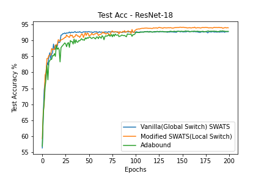
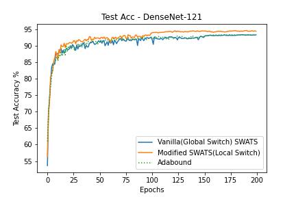

# Rethinking-SWATS-Optimizer
Rethinking SWATS (Switches from Adam to SGD) Optimizer. Performing the switch Locally than Globally.

## Prerequisites

- PyTorch == 1.5.1

## Overview

Elementwise scaling of learning rate adopted by Adaptive Optimizers such as Adam, RMSProp etc often generalise poorly due to unstable and non-uniform learning rates at the end of training, although they scale well during the initial part of training. Hence SGD is the go-to for SOTA results since it generalizes better than adaptive methods.

SWATS is a method which switches from Adam to SGD when the difference between the bias corrected projected learning rate and the projected learning rate is less than a threshold ϵ.The projected learning rate is found by projecting the SGD's update onto Adam's update. The switch is global i.e. if one of the layers of the network switches to SGD, all the layers are switched to SGD. 

## Switching Locally than Globally

Switching all the layers to SGD just because a particular layer switched to SGD is something which has to be investigated. Why should a Dense or Batch Norm Layer impact Convolutional layer's training? So I went ahead and made the switch local i.e a layer's switch to SGD is independent of other layer switching to SGD i.e. at a given time some layers will be in SGD Phase while the rest of them are still using Adam.

## Experiment

To perform the analysis I use ResNet-18 on Cifar-10 from <a href = "https://github.com/kuangliu/pytorch-cifar">this repository</a>. 
Since paper's default value of ϵ (threshold to switch) wasn't working for me, I've reduced ϵ value from 10^-9 to 10^-5. Since ϵ value is left as a hyperparameter in the paper, I guess this is okay to do :)

## Setup

- batch-size = 128
- epochs = 200

### ResNet - 18
1. SWATS (GLOBAL SWITCH)
    - initial step size (adam) 0.001
    - step size decay by a factor of 10 at 100 epochs.

2. New SWATS (LOCAL SWITCH)
    - step size decay by a factor of 10 at 75,150 epochs for layers which are in SGD Phase.
    - step size decay by a factor of 10 at 100 epochs for layers which are in Adam.

3. Adabound
    - step size decay by a factor of 10 at 100 epochs for AdaBound.
    
### DenseNet - 121
1. SWATS (GLOBAL SWITCH)
    - initial step size (adam) 0.001
    - step size decay by a factor of 10 at 150 epochs.

2. New SWATS (LOCAL SWITCH)
    - step size decay by a factor of 10 at 75,150 epochs for layers which are in SGD Phase.
    - step size decay by a factor of 10 at 100 epochs for layers which are in Adam.

3. Adabound
    - step size decay by a factor of 10 at 150 epochs for AdaBound.

## Comparision

Since AdaBound is the only paper which I know which changes smoothly or in other words continuously transforms from Adam to SGD, rather than a hard switch like SWATS, it is fair to compare SWATS with AdaBound.

## Results

 

| Model   | Optimizer | Switch  | Test Acc.  |
| ------- | -------- | ------- |-----------|
| ResNet-18 | SWATS | Global (Vanilla) |  92.89 |
| ResNet-18 | SWATS | Local | 94.13 |
| ResNet-18 | AdaBound | NA | 93.0 |
| DenseNet-121 | SWATS | Global (Vanilla) |  93.30 |
| DenseNet-121 | SWATS | Local | 94.62 |
| DenseNet-121 | AdaBound | NA | 93.36 |

## Switch Over Points(Steps) for Local Switch
### ResNet-18
| Layer | Steps | Estimated Learning Rate For SGD |
| ------- | -------- | ------- |
linear.weight | 29 | 0.015315 |
layer1.0.conv1.weight | 1011 | 0.149228 |
layer2.0.conv1.weight | 2354 | 0.673763 |
layer1.1.bn1.bias | 2597 | 0.204322 |
layer2.1.bn1.weight | 3230 | 0.416590 |
layer2.0.shortcut.0.weight | 3415 | 0.278827 |
layer1.0.bn1.bias | 3690 | 0.156899 |
bn1.bias | 4850 | 0.117717 |
layer1.1.bn2.bias |5574| 0.320231|
linear.bias |5645 | 0.015616|
layer3.0.bn2.weight |5744 | 0.420847|
layer2.1.bn1.bias |6897 | 0.378199|
layer3.0.bn1.bias |6996 | 0.599258|
layer2.0.shortcut.1.weight |7972| 0.276019|
conv1.weight| 7994 |0.042911|
layer1.0.conv2.weight| 8079| 0.649479|
layer1.1.bn2.weight| 10320 |0.157036|
layer2.0.bn2.bias| 11477 | 0.382424|
layer2.0.shortcut.1.bias |11477 |0.382424|
layer3.0.shortcut.0.weight |11729 |1.180122|

### DenseNet-121
| Layer | Steps | Estimated Learning Rate For SGD |
| ------- | -------- | ------- |
| conv1.weight | 180 | 0.012701 |
| dense2.0.conv1.weight | 776 | 0.802031 |
| dense1.0.bn2.weight | 938 | 0.499405 |
| dense1.0.conv1.weight | 1020 | 0.199502 |
| dense1.0.bn1.weight | 1411 | 0.195258 |
| trans1.conv.weight | 1499 | 0.269556 |
| dense2.10.conv2.weight | 1683 | 3.295926 |
| dense4.6.conv2.weight | 1826 | 4.965084 |
| dense3.0.bn1.weight | 2013 | 4.180832 |
| dense2.3.bn2.weight | 2252 | 2.053317 |
| linear.bias | 2805 | 0.028812 |
| dense3.9.bn2.weight | 3695 | 2.368862 |
| trans1.bn.bias | 3782 | 0.382468 |
| dense1.2.conv1.weight | 4286 | 0.857455 |
| trans1.bn.weight | 4525 | 0.329345 |
| dense3.9.bn1.weight | 4629 | 4.333698 |
| dense3.4.conv2.weight | 4802 | 2.658655 |
| dense2.1.bn1.bias | 4953 | 1.257946 |
| dense3.8.conv1.weight | 5268 | 6.371582 |
| dense2.0.bn2.bias | 5538 | 1.395342 |
| dense3.7.bn2.weight | 5664 | 1.882873 |
| dense2.4.bn2.weight | 7457 | 1.158317 |
| dense1.4.conv2.weight | 8148 | 2.967311 |
| trans3.bn.weight | 8449 | 1.047665 |
| dense2.2.bn1.bias | 9793 | 1.812838 |
| dense3.9.conv1.weight | 10624 | 8.560639 |
| dense3.4.bn1.weight | 12009 | 1.662682 |
| dense2.6.conv2.weight | 22923 | 28.562759 |

## Conclusion
The idea of having some layers stay back in Adam phase and some of them moving forward to SGD(M) phase show that you need not switch all the layers to generalize better. Morever in Vanilla SWATS if the switch happens too early, Adaptive estimates cannot be utilised to the full extent. But if the switch is <b>Local</b>, some layers which are in Adam phase will help the initial part of training although the remaining layers have moved on to SGD. 

As seen from the table above some layers(convolutional) in DenseNet have learning rates 8.56, 28.56. One may wonder how is the model converging at such high lr. I think this is due to Batch Normalization and it working well with exotic exponential learning rate schedulers <a href = 'https://arxiv.org/pdf/1910.07454.pdf'> Ref </a> 
## Note
Since there is no official implementation of SWATS from the authors, the code for it is borrowed from <a href = 'https://github.com/Mrpatekful/swats'> here </a>. (SwatsVanillaGlobal.py).

<b>If you find any bug in my implementation of switching it locally or find the idea of switching it locally "obscure", kindly feel free to drop an issue or email me at maiyaanirudh@gmail.com.</b>
